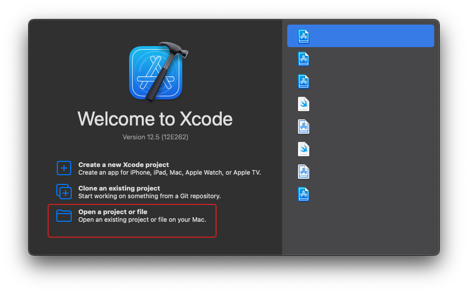
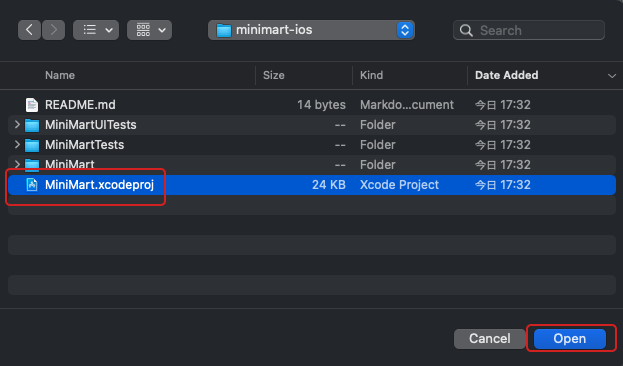
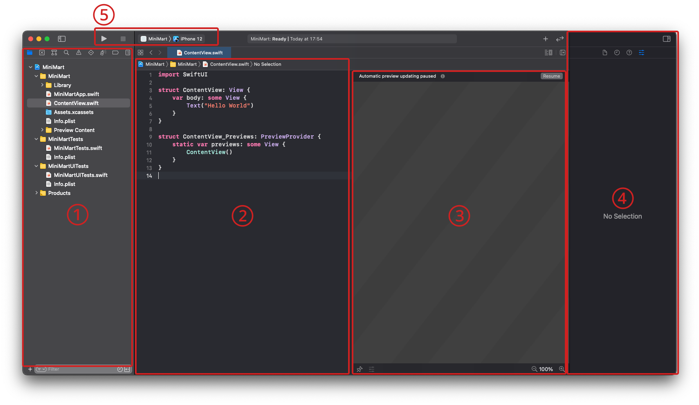
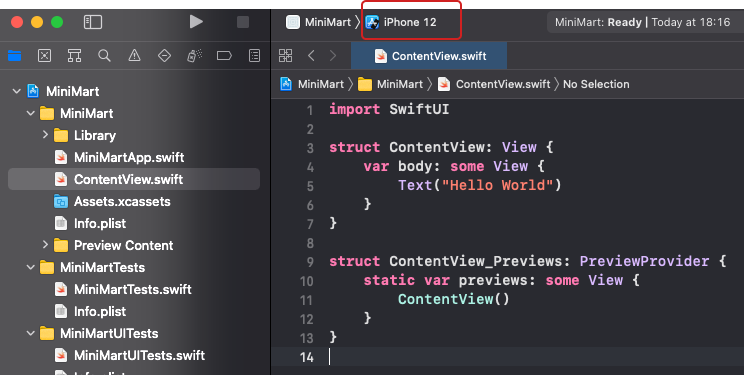
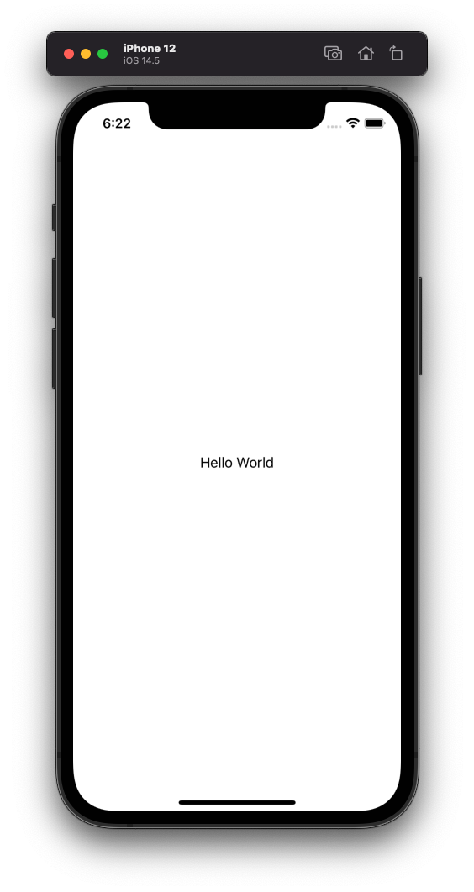

# はじめてのiOSアプリのビルドと実行

まずは、Xcodeにて

- ソースコードをビルドし、シミュレータでiOSアプリを動かすところ

をやってみます。

## ForkとClone

以下のリポジトリを Fork して clone してください。

https://github.com/cookpad/cookpad-internship-2021-summer-ios/

作業中の質問に回答する際など、出来ているところまで push してもらう可能性があります。 

## プロジェクトを開く

Xcode.appを開きます。

「Open a project or file」を選択してください

フォークしたプロジェクトのあるフォルダを開いて、`MiniMart.xcodeproj`を選択し、`open`をクリックします。

## Xcodeの簡単な説明

プロジェクトを開くと、Xcodeの画面が開きます。

まず、左のペインから`ContentView.swift`を選択してください。

ソースコードが開くと次のような画面が開きます。

簡単にそれぞれ説明していきます。

1. ナビゲーションエリア
  - ファイルツリーの表示、ツリーからファイルを選択してエディタエリアで開く、プロジェクト内検索（`⌘⇧F`）といった機能があります
2. エディタエリア
  - ソースコードを記述する場所
3. キャンバス
  - Xcode Previewが表示される場所
4. インスペクタエリア
  - 主にファイルの情報が表示されたり、SwiftUI 等を編集しているときの UI パーツのパラメータ調整をする場所
5. 実行、停止、アプリケーションの選択、実行対象の選択
  - ここで実行するアプリケーション、シミュレータを選んで実行、停止ができる。

### 💡 便利なショートカット

[ショートカットリスト](https://github.com/cookpad/cookpad-internship-2019-summer/blob/master/ios/docs/shortcuts.md)に開発をする上で便利なショートカットを載せておくので、Chrome の別タブで開いたり、印刷して手元に置いたりしてみてください。  
また、講義資料内では、対応する動作にショートカットがある場合は、(`ショートカットキー`)という表記を付けておきます。

#### 記号

- ⌘: コマンドキー(cmd)
- ⇧: シフトキー(shift)
- ⌃: コントロールキー(ctrl)
- ⌥: オプションキー(opt/alt)

## デバッグ実行をする

ではまずは「デバッグ実行」をしてシミュレータを起動します。
画面左上のエリアから実行対象として適当なシミュレータを選択してください。

(この画像ではiPhone12のシミュレータを実行対象にしています)

選択ができたら「＞」ボタンを押し実行しましょう。（`⌘R`でも可能です）

また、単純にビルドを行い、ソースコードが正しくコンパイルできるかを実行する場合は（`⌘B`）でビルドのみ行うことができます。  

---

[Chapter2へ進む](chapter_02.md)
