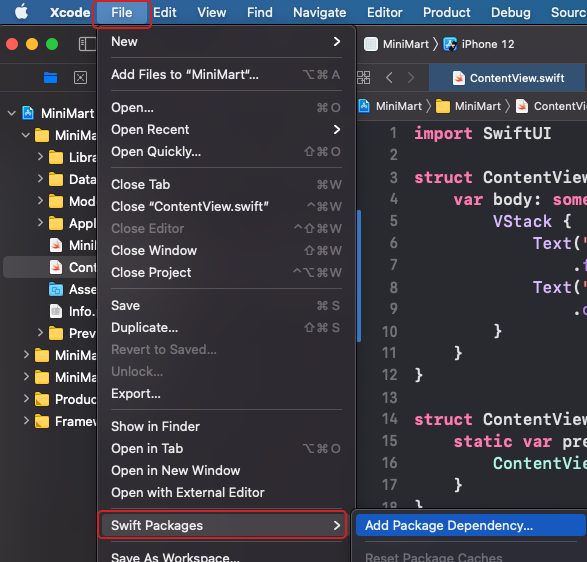
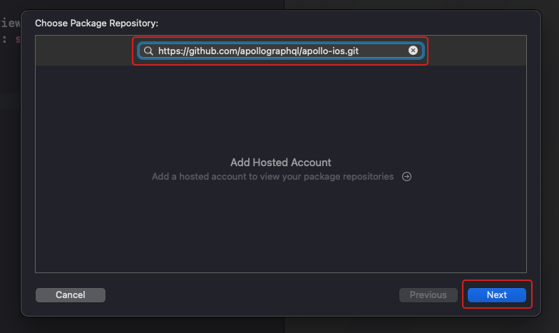
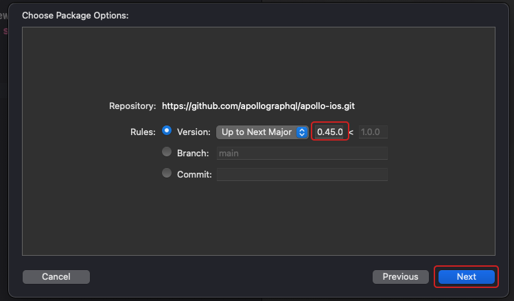
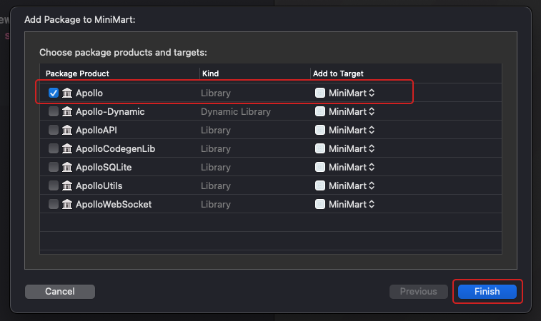
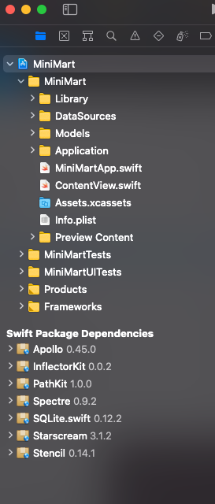
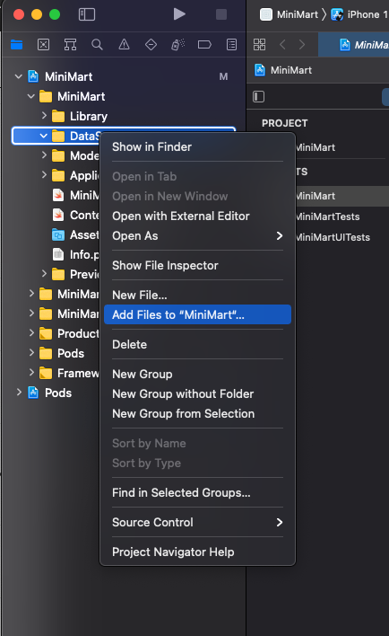
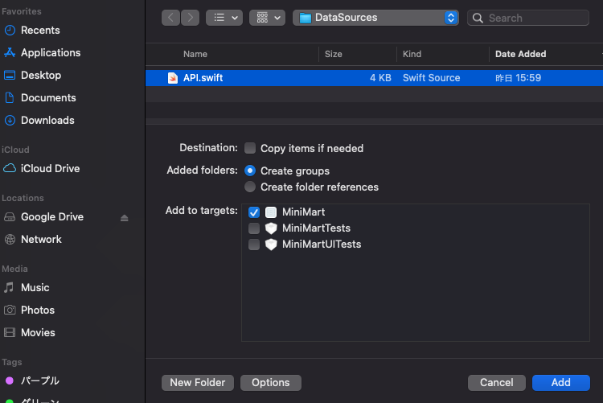

# 2. 下準備

Xcodeでのビルドが動いたところで、次にMiniMartの開発に必要な諸々を準備します。

この章ではアプリで`graphql`のAPIサーバと通信ができる状態にするために

- Swift Package Managerというツールを使って`apollo-ios`を導入
- 必要なファイルを生成するために、npmモジュール`apollo-tooling`の導入
- Network.swiftをXcodeに追加する

を、行います。

## SPMによるapollo-iosの追加

[Swift Package Manager](https://swift.org/package-manager/)はSwift向けの標準のライブラリ管理ツールです。
リリース当初はコマンドラインでしか使えなかったものですが、Xcode11からはiOSアプリ開発でも使えるようになりました。
これを利用することで簡単にプロジェクトへ外部のライブラリを導入して使えるようになります。
iOSアプリ開発におけるライブラリ管理ツールは他にもあり、特に[CocoaPods](https://cocoapods.org/)が有名ですが、本講義ではSPMによる導入を行います。

SPMによるパッケージを追加は、Xcodeから行います。
Xcodeのウィンドウを選択し、メニューから`File > Swift Packages > Add Package Dependency...`を選択します



追加するパッケージのURLを入力します。
表示されたウィンドウのテキストフィールドに`https://github.com/apollographql/apollo-ios.git`と入力し、`Next`を選択してください。



パッケージのバージョンのルールを選択します。
`Rules`が画像の状態になっていることを確認し、`Next`を選択します。
※ 画像は0.45.0ですが、0.46.0でも問題ありません。



最後に、プロジェクトに追加するパッケージを選択します。
今回は`Apollo`のみを選択し、`Finish`をクリックしてください。



正常に終了すると、ナビゲーションエリアの下の方に`Swift Package Dependencies`というセクションが追加され、`Apollo 0.45.0`他依存パッケージが追加されています。



一度ビルドをしてみて、成功することを確認してください。

## apolloのインストールとschema.jsonのダウンロード

apollo-iosを使う場合、APIサーバと通信をしようとした場合、ライブラリ単体でいきなり使い出すことはできません。
スキーマの定義が書かれた`schema.json`とクエリ等が書かれている複数のgraphqlファイルから、リクエストとレスポンスの定義が書かれた1つのswiftファイル(`API.swift`)を生成し、これを使います。
この処理を行うのに必要な`apollo-tooling`をインストールします。

リポジトリのルートに`package.json`を作成し、次のように記述します。
```
{
    "private": true,
    "devDependencies": {
      "apollo": "^2.33.4"
    },
    "scripts": {
      "download-schema": "apollo schema:download --header=\"[auth]\" --endpoint=[API Endpoint] schema.json",
      "codegen": "apollo codegen:generate --target=swift --includes=./**/*.graphql --localSchemaFile=schema.json MiniMart/DataSources/API.swift"
    }
}
```

`[API Endpoint]`を、APIサーバのURLにしてください。パスが`/`でなく`/graphql`になることを注意してください。
`[auth]`には当日伝えられる認証のための情報を埋めてください。


`--endpoint=https://my-graphql-server/graphql` のようになります。

記述がおわったら、yarn と打って apollo のインストールをします。

### schema.jsonのダウンロード

次に`schema.json`をダウンロードします。

`yarn download-schema`と打ち実行してください。

```
  ✔ Loading Apollo Project
  ✔ Saving schema to schema.json
```

のような表示がされ、`schema.json`が生成されていれば成功です。

## schema.json とクエリから GraphQL リクエストの定義を出力する

次にgraphqlファイルを作成します。

graphql/fetchProducts.graphqlというファイルを次の内容で作成してください。

```graphql
query fetchProducts {
  products {
    id
    name
    price
    summary: description
    imageUrl
  }
}
```

`description`に`summary`という別名をつけて引いているのは、Swiftにおいて`description`はインスタンスの説明をするプロパティとして半ば予約語のようになっており、好ましくないからです。

作成ができたら、`yarn codegen`と打ち実行してください。

```
  ✔ Loading Apollo Project
  ✔ Generating query files with 'swift' target - wrote 1 files
```

のような表示がされ、`MiniMart/DataSources/`に`API.swift`が生成されていれば成功です。

## 出力されたファイルをXcodeに追加する

生成されたファイルをプロジェクトに追加します。
`DataSources`グループを選択 -> 右クリックし、「Add Files to "MiniMart" ...」を選択します。



開いたウィンドウから`API.swift`を選択し`Add`をクリックしてください。




追加ができたらビルドを行い、成功することを確認しましょう。

## Network.swiftを用意する

最後に[公式のチュートリアル](https://www.apollographql.com/docs/ios/initialization/#basic-client-creation)に従い、ApolloClientのインスタンスを共有するためのSingletonのクラスを作成します。

`DataSources`グループを選択 -> 右クリックし、「New File...」を選択し、`Network.swift`を新規に作成します。
以下の内容をコピーしてください。
その際、以下の内容を伝えられる内容に合わせて修正してください。
- `[API Endpoint]`は、APIエンドポイントのURLに置換してください。
- `[Your id]`には、ログインユーザー名を指定してください。
前日のwebの講義で利用したものを使っても良いし、変えても問題ありません。
- `[AuthKey]`と`AuthValue`には当日伝えられる認証情報を埋めてください。

```swift
import Apollo
import Foundation

final class Network {
    static let shared = Network()

    private(set) lazy var apollo: ApolloClient = {
        let url = URL(string: "[API Endpoint]")!
        let store = ApolloStore(cache: InMemoryNormalizedCache())
        let provider = DefaultInterceptorProvider(store: store)
        let transport = RequestChainNetworkTransport(interceptorProvider: provider,
                                                     endpointURL: url,
                                                     additionalHeaders: [
                                                        "X-User-Name": "[Your id]",
                                                        "[AutyKey]": "[AuthValue]"
                                                     ]
        )
        return ApolloClient(networkTransport: transport, store: store)
    }()
}
```
作成ができたら再びビルドを行い、成功することを確認しましょう。

ここまでで、次回以降の開発に必要な下準備ができました。商品一覧画面の実装を進めていきます。

---

[Chapter3へ進む](chapter_03.md)
