# 商品リストを作る

この章ではXcode Previewでダミーのデータのリストを表示することを目指します。

完成するとXcode Previewで以下の画像のようになります。

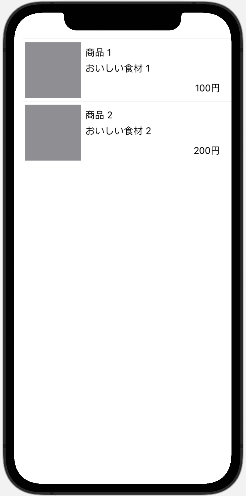

この章は商品リスト画面の作成を通して

- 画像, テキストを表示する方法
- 複数の要素を縦(or 横)方向に並べる方法
- ModifierやSpacer, Stackを使い、レイアウトを調整する方法
- 繰り返し要素を表示する方法

を、学びます。

## 講義: SwiftUI Appの概要

ハンズオンに入る前に、SwiftUIのViewの概要を説明します

### SwiftUI Appのエントリーポイント

SwiftUI Appは`@main`という属性のついた、`App`プロトコルに準拠した構造体をエントリーポイントとして処理が開始されます。
`MiniMart`では`MiniMartApp.swift`というファイルに含まれる`struct MiniMartApp`がそれにあたります。

```swift
import SwiftUI

@main
struct MiniMartApp: App {
    var body: some Scene {
        WindowGroup {
            ContentView()
        }
    }
}


```

`body`プロパティの`WindowGroup`配下に書かれている`ContentView`がアプリの起動時に表示されるViewです。この`ContentView`を別のViewにすれば起動時に表示されるViewを変えることもできます。

ここに登場している、`App`, `WindowGroup`というのはSwiftUIのアプリを構成する概念を実装に落とし込んだものですが、iOSアプリでは意識する必要がないため、割愛します。
興味のある方は[App essentials in SwiftUI](https://developer.apple.com/videos/play/wwdc2020/10037/)を見てみてください。

## SwiftUI Viewの基本

次にViewの基本的な考え方を説明します。

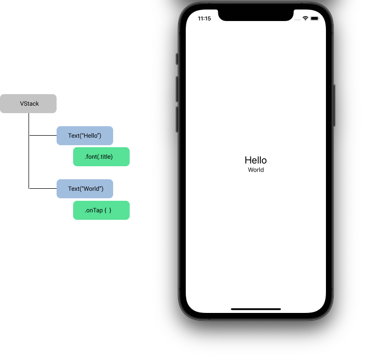

SwiftUIでは基本の`View`として`Text`, `Button`, `Image`のような表示要素や、`VStack`, `HStack`などのレイアウトを行う要素を提供しています。

また、Viewは`ViewModifier`という機能でカスタマイズをすることができます。

`ViewModifier`にはViewの周りに隙間をあける`.padding`や描画するフォントを変える`.font`等の表示に関わるものや、`onTapGesture`や`onAppear`などViewのイベントに関わるものがあります。

これらの基本的な`View`と`ViewModifier`を組み合わせて、アプリケーションのビューを組んでいきます。

例えば図の例では、`Hello`と`World`という2つの文字列を`Text`というViewで表示しています。
`Hello`を表示している`Text`のフォントを`.font`というモディファイアを使って変えています。
この2つのViewを`VStack`という自身の子を縦に並べるViewを使って並べています。

### Viewの実装とXcode Preview

次にViewの実装ファイルと、Xcode Previewの説明します。

`ContentView.swift`開き`キャンバスエリア`の`Resume`をタップすると以下のような表示になります。

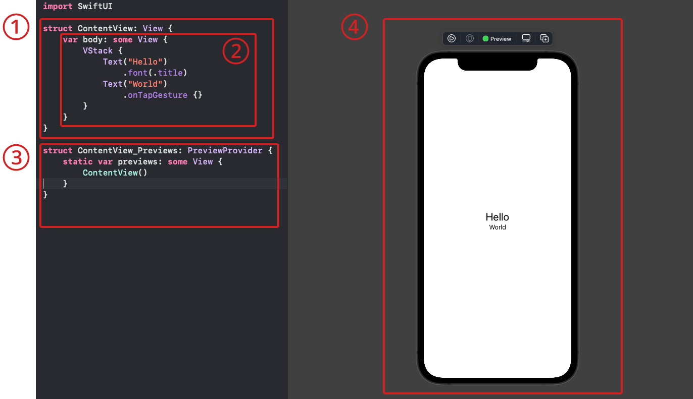

1. カスタムビューの定義。`View` protocolを実装した`struct`を定義する。
2. カスタムビューの中身。`body` というcomputed propertyを定義し、その中にコンテンツを追加する
3. Xcode Previewの定義。`PreviewProvider`protocolを実装したstructを定義し、`static var previews`というcomputed propertyにPreviewエリアに表示したい内容を記述します。
`preview対象のview名_Previews`という名前で定義をします。
4. Previewのキャンバスです。表示の確認だけでなく、GUIによるViewの編集を行うことができます。


## ハンズオン

ここからはハンズオンです。

### 空っぽの画面を作る

プロジェクトに`ProductListPageView.swift`ファイルを追加します。
`Application/Views`グループを右クリックし、New File...を選択します。

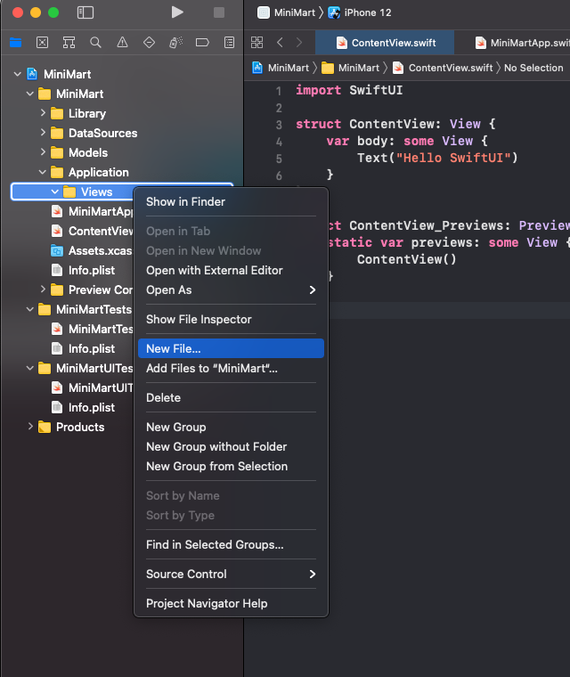

`SwiftUI View`を選択し、ダブルクリックをするか、`Next`ボタンをクリックしてください。

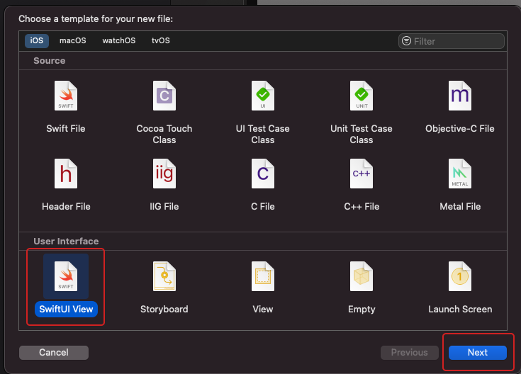

`ProductListPageView.swift`という名前に変え、`Save`ボタンをクリックします。

その際`Targets`のチェックが`MiniMart`に**のみ**入っていることを確認してください。

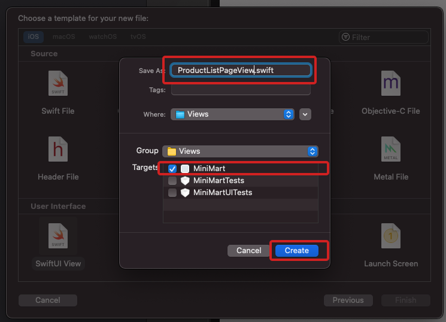


`Text("Hello World")`だけが表示されているファイルができました。

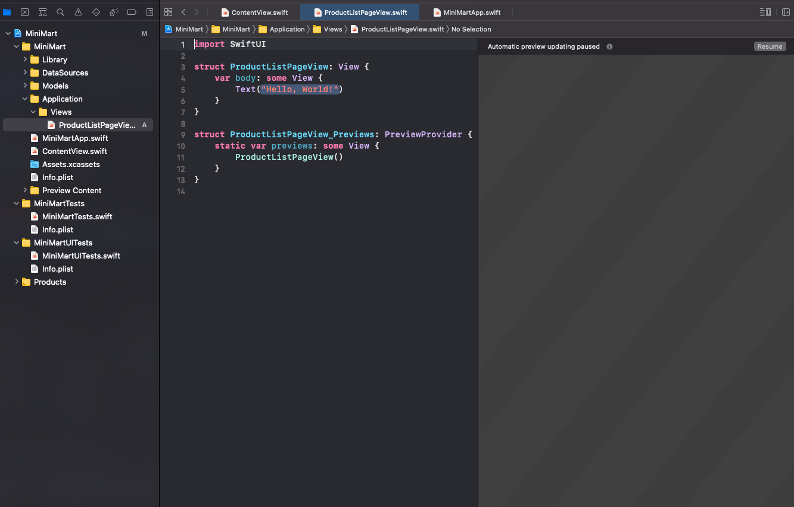

新規に作ったSwiftUI Viewはすべてこの形です。


### ProductListPageViewにProductの配列をもたせる

`ProductListPageView`にプロパティの`products`を追加します。
初期値として空の配列を代入しておきます

```diff
import SwiftUI

struct ProductListPageView: View {
+   var products: [FetchProductsQuery.Data.Product] = []
    var body: some View {
        Text("Hello, World!")
    }
}

```

### 名前の一覧が出るようにする

名前の一覧を表示できるように`ProductListPageView`の`body`を実装します。

`List`はデータを1行で表示し、オプションで1つまたは複数の行を選択することができる機能を持つViewです。

配列を表示する場合、いくつかの書き方がありますが最もシンプルには以下のように実装できます。

```diff
struct ProductListPageView: View {
    var products: [FetchProductsQuery.Data.Product] = []
    var body: some View {
-       Text("Hello, World!")
+       List(products, id: \.id) { product in
+           Text(product.name)
+       }
    }
}

```

このままでは何も表示されないので、
Previewの実装にはダミーの値を渡しましょう

```swift

struct ProductListPageView_Previews: PreviewProvider {
+   static let products = [
+       FetchProductsQuery.Data.Product(
+           id: UUID().uuidString,
+           name: "商品 \(1)",
+           price: 100,
+           summary: "おいしい食材 \(1)",
+           imageUrl: "https://image.cookpad-mart.com/dummy/1"
+       ),
+       FetchProductsQuery.Data.Product(
+           id: UUID().uuidString,
+           name: "商品 \(2)",
+           price: 200,
+           summary: "おいしい食材 \(2)",
+           imageUrl: "https://image.cookpad-mart.com/dummy/2"
+       ),
+   ]
    
    static var previews: some View {
-       ProductListPageView()
+       ProductListPageView(products: products)
    }
}

```

ここで `Xcode Preview`を確認し、商品名が表示されていればOKです。(画像は商品3まで出てますが、↑のコード例では商品2までが出る)

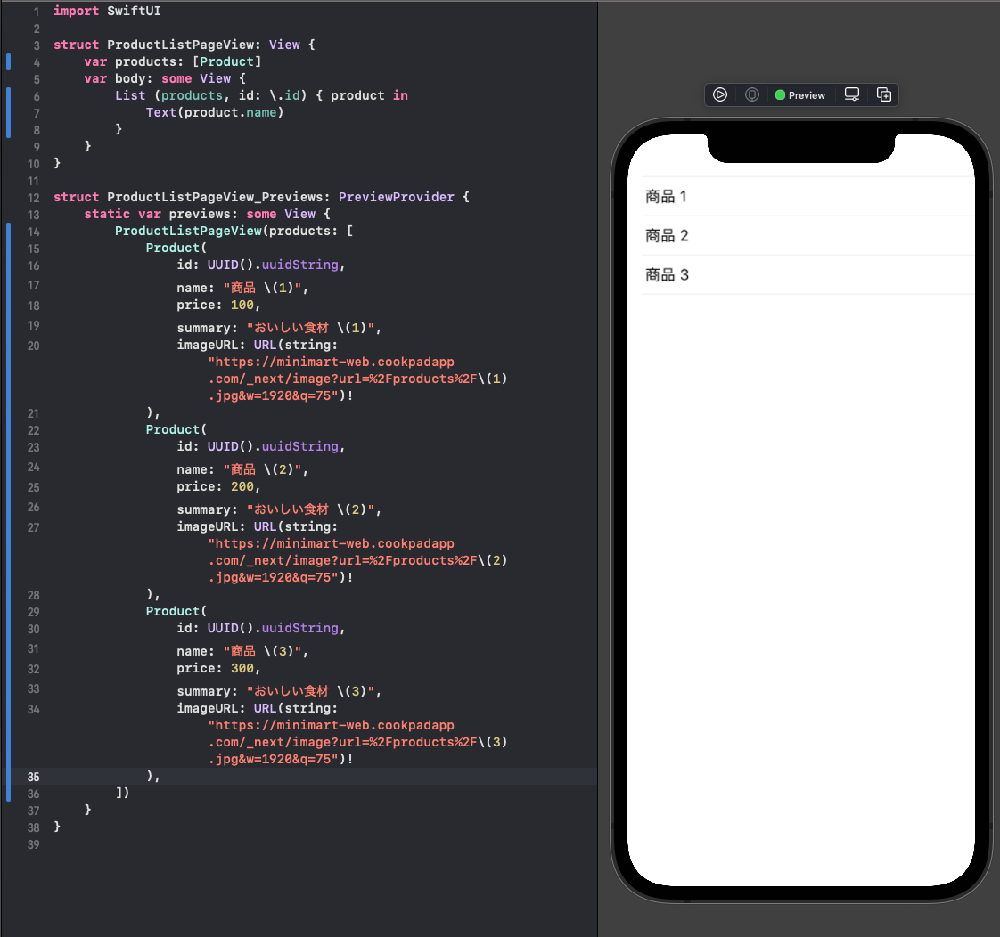

### 補足: ソースコードの説明

ソースコードについて補足します。

```swift
struct ProductListPageView: View {
    var products: [FetchProductsQuery.Data.Product] = []
    var body: some View {
        List(products, id: \.id) { product in
            Text(product.name)
        }
    }
}

```

次に第２引数に渡している`\.id`とはなんでしょうか。
これは`\FetchProductsQuery.Data.Product.id`を省略したもので、`KeyPath`と呼ばれる型の値です。
この例は「`FetchProductsQuery.Data.Product`の`id`プロパティへのキー」という意味です。

KeyPathは任意の型のプロパティに添え字アクセスをするための仕組みです。
`KeyPath`を使うとまるで辞書型のように変数のプロパティへアクセスできます。

以下の例では`keyPathForID`というKeyPath型の変数を使って、`Product`型の`idプロパティの値を取得しています

```swift
let product: [FetchProductsQuery.Data.Product] = dummy
let keyPathForID = \FetchProductsQuery.Data.Product.id
debugPrint(product[keyPath: keyPathForID]) // product.idの値が出力される

```

これを渡しているのは、Listのような配列を表示するSwiftUIのViewはその子要素が一意に決まる値を求めるからです。(Reactでもkeyを渡すことがありますが、それと同じ)これはSwiftUIのフレームワークがViewと配列の要素を紐付けて差分更新を行うためです。
`FetchProductsQuery.Data.Product`はidを持っており、これはProduct全体でユニークです。
なので、KeyPathとして`\.id`を渡しています。
SwiftUIは渡されたKeyPathを使って配列の要素のidの値を取得し、Viewと配列要素の紐付けを行うことに利用しています。

### 複数の要素を配置する

テキスト今回作成するビューには以下の要素を配置する必要があります

- 商品の画像
- 商品名
- 商品の説明
- 価格

SwiftUIのビューを作成する際には、コンテンツ、レイアウト、動作をビューの`body`に記述していきます。
しかし、`body`は単一のビューしか返しません。
ではどうすれば良いでしょうか。
複数のパーツを組み合わせたビューを表現するには、スタックを使って各パーツを並べます。
スタックには、水平方向に並べる`HStack`, 垂直方向に並べる`VStack`, 前後方向(画面の前面から背面への方向)に並べる`ZStack`の3種類があります。

まずはHStackを使って画像と商品名を水平方向に並べてみましょう。
画像はSwiftUI中では`Image`を使うのですが、iOS14ではURLを指定して画像を読み込む機能がサポートされていません。`RemoteImage`というビューを用意してあるので今回はこれを利用します。

`Text`を`HStack`で包み、`RemoteImage`を`Text`の上に追加します。

```diff
struct ProductListPageView: View {
    var products: [FetchProductsQuery.Data.Product] = []
    var body: some View {
        List(products, id: \.id) { product in
-           Text(product.name)
+           HStack {
+              RemoteImage(urlString: product.imageUrl)
+              Text(product.name)
+           }
        }
    }
}
```

Previewを確認し、引き伸ばされた灰色の領域が表示されていればOKです。

次に説明と値段を追加しましょう。
これらは名前の下に配置されています。
垂直方向に要素をグルーピングするのには`VStack`を使います。
`Text(product.name)`をVStackで包み、説明と値段をそれぞれTextで追加してみます。

priceはInt型のため、Textにはそのままでは渡せないのでString型に変換をする必要があります。
今回のケースでは`"\(product.price)円")` のように文字列中に展開して`円`を末尾につけてあげれば十分でしょう。

```diff
struct ProductListPageView: View {
    var products: [FetchProductsQuery.Data.Product] = []
    var body: some View {
        List(products, id: \.id) { product in
            HStack {
                RemoteImage(urlString: product.imageUrl)
-               Text(product.name)
+               VStack {
+                   Text(product.name)
+                   Text(product.summary)
+                   Text("\(product.price)円")
+               }
            }
        }
    }
}
```

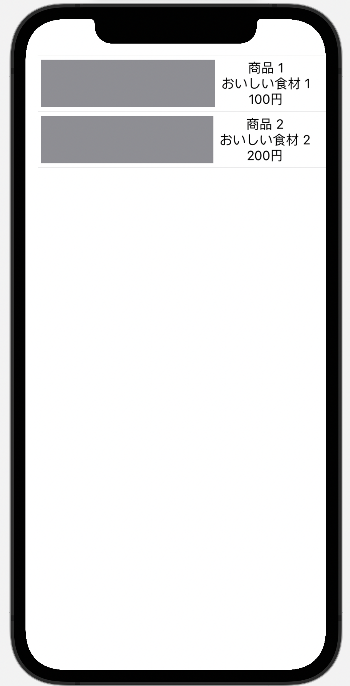

ここまでで、表示する要素がおおよそ狙った位置に表示できるようになりました。

### レイアウトを整える

次にレイアウトを整えましょう。

以下のように要素を配置します。

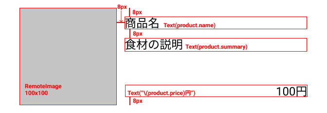

- 画像のサイズを100x100に収める
- 名前と説明は左上に置いて、上から8px開けたい。テキスト間も8px開けたい
- 説明と値段の間は可能な限り開けたい
- 値段は下から8pxの位置に置きたい

上下左右にも余白がありますが、`List`が勝手に空けるものなので、指定はしません（逆にいうと、どうやっても空いてしまう）

#### 1. Viewを固定サイズで表示する

画像を100x100に収めます。　
ビューを固定のサイズにしたい場合、`.frame`というモディファイアを利用します。

```diff
struct ProductListPageView: View {
    var products: [FetchProductsQuery.Data.Product] = []
    var body: some View {
        List(products, id: \.id) { product in
            HStack {
                RemoteImage(urlString: product.imageUrl)
+                   .frame(width: 100, height: 100)
                VStack {
                    Text(product.name)
```


#### 2. Stackのalignment

次に右側のテキスト要素を中心でなく、上に持ってきたいです。
これはモディファイアでなく、HStackのプロパティで設定します。
以下のように記述してください。

```diff

     var body: some View {
         List(products, id: \.id) { product in
-            HStack {
+            HStack(alignment: .top) {
```

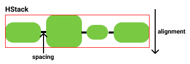

このalignmentプロパティはHSTackが自分の配下のViewの縦方向の位置を決めるためのプロパティです。
デフォルトではスタックの中心に来るように設定されています。


同様に右側のテキスト要素もセンタリングされているので、これを左寄せにしたいです。
これはVStackのalignmentのプロパティで設定します。
以下のように記述してください。

```diff
             RemoteImage(url: product.imageURL)
                 .frame(width: 100, height: 100)
-            VStack {
+            VStack(alignment: .leading) {
                 Text(product.name)
```

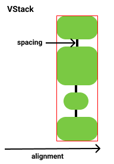

これはVStackが自分の配下のViewの横方向の位置を決めるためのプロパティです。
HSTackと同様、デフォルトでは中心に来るように設定されています。

#### 補足: leadingとtraiilng

leadingが先頭、trailingが末尾を表しています。なぜleft, rightでないのかというと、
アラビア語等、右側から左側に向かって文字を読んでいく言語圏へのサポートのためです。
日本語のような左から右へ読んでいく言語ではleadingはleft, trailingはrightを意味し、アラビア語等ではその逆です。
left, rightでなく, leading, trainlingの指定しておくことで、言語設定が異なるデバイスでも、その言語にとって自然な方向にコンテンツが配置されるようになっています。
SwiftUIに限らずアップルのUIのフレームワークでは頻出する単語なので覚えておきましょう。

#### 3. Stackの要素間に隙間を設定する

次に、テキスト間の隙間を開けます。
名前と説明の間は8px, 説明と値段の間は可能な限り広げます。
全要素を等間隔で隙間を開けたい場合はVStackのspacingのプロパティで制御するのが一般的ですが、今回はバラバラです。
要素間に任意の大きさの幅を開けるのには`Spacer()`が便利です。

以下のように変更します。

```diff
                VStack(alignment: .leading) {
                    Text(product.name)
+                   Spacer()
+                       .frame(height: 8)
                    Text(product.summary)
+                   Spacer()
                    Text("\(product.price)円")
                }
```

#### 4. Viewに余白を設定する

上下に8pxの余白をあけます。

あるコンテナの上下左右に余白を開けるのには`.pading`というモディファイアが最適です。

今回は上下に8pxの余白を設けたいので、以下のように変更します

```diff
                VStack(alignment: .leading) {
                    Text(product.name)
                    Spacer()
                        .frame(height: 8)
                    Text(product.summary)
                    Spacer()
                    Text("\(product.price)円")
                }
+               .padding(.vertical, 8)

```

`.vertical`はViewの上と下を表す指定です。


#### 5. 一部のViewだけを右寄せにする

最後に値段を右寄せにします。これは少しトリッキーな指定です。

以下のように変えてください。

```diff
                    Text("\(product.price)円")
+                       .frame(maxWidth: .infinity, alignment: .trailing)
```


考え方について説明します。

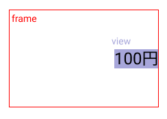

Viewは1つ1つがフレームという領域を持っています。
フレームとはレイアウトの基準となる枠のことです。
図の赤枠がframeです。

何も指定しなければ、フレームはそのViewのサイズと同じになりますが、明示的に指定することもできます。
前段の画像では、フレームを100x100の固定サイズにすることで画像をその枠内に収めました。
今回はmaxWidthに`infinity`を指定することで、画面の端や別のViewにぶつかるまで横幅が広がります。

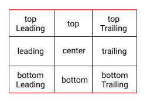

第２引数のalignmentはこの広がったフレームの中でViewをどう整列させるのか、という指定です。
図のように、垂直方向で上中下、水平方向で左中右の3x3マスの中からどの位置の置くのかという指定ができます。

今回は`trailing`を指定することで、広がった枠の垂直方向の中心、水平方向の末尾（＝右端）に整列させるようにしています。

### 確認

ここで以下の表示になっていればOKです。


---

[Chapter4へ進む](chapter_04.md)
