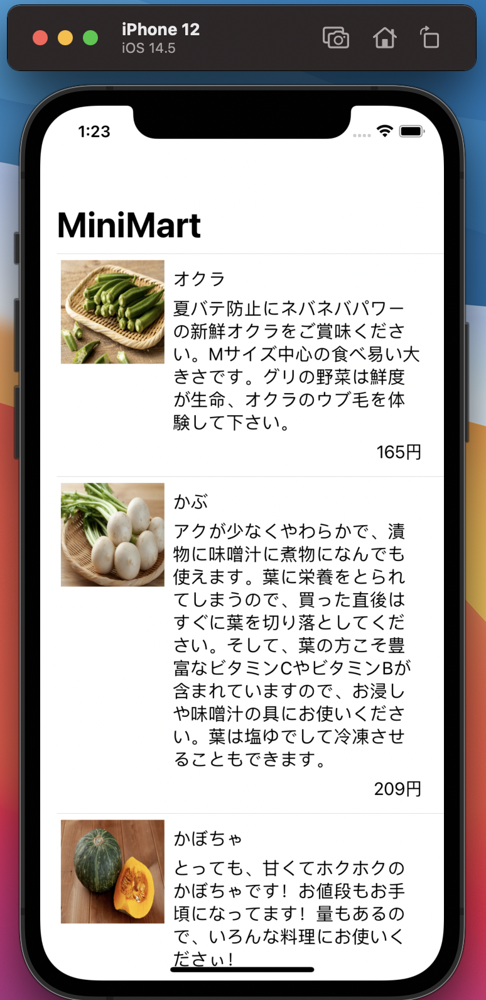
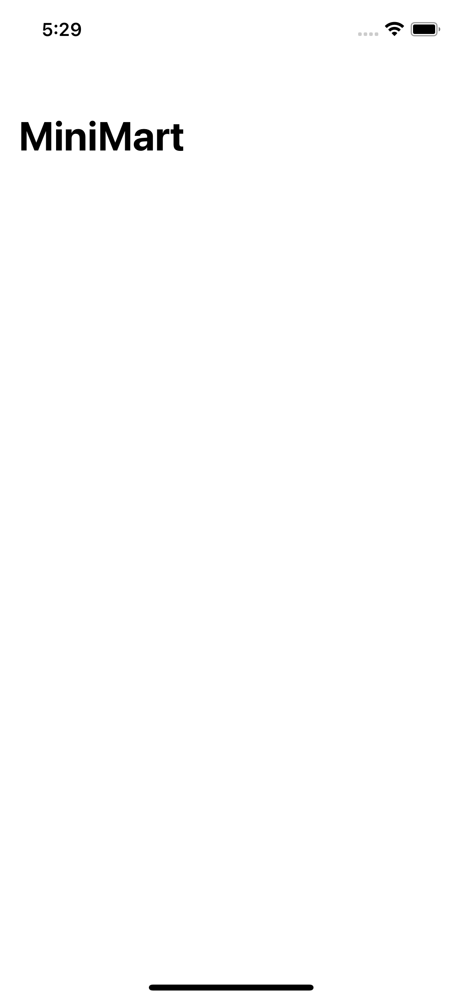

# APIから商品の一覧を読み込む

chapter3が終わってない人は、いったん出来たところまでコミットしてください。
その後
```
git checkout ch4-start
```
とすると、このchapterが開始できるところまでコードが進みます。

前章ではXcode Previewでダミーのデータを表示するところまで作りました。
この章ではAPIを叩いた結果をリストに表示します。
さらにプレビューでなくシミュレータで表示することを目指します。




この章ではAPIから取得した結果をViewに反映させる作業を通して、

- イベントに反応して処理を進める方法
- apollo-clientを使ってネットワークリクエストを送るを方法
- ViewにStateを持たせ、それを表示に反映させる方法

を、学びます


## 講義: 状態とデータフロー


APIから引いてきた結果を表示するためには、Viewが「状態」を持つ必要があります。
SwiftUIでも外部からのイベントやユーザーのアクションによって、データを変更し、その影響を受ける部分を更新する仕組みが備わっています。

いくつかの手段が用意されていて、実装と特徴を紹介していきます。

### State

Viewのプロパティの変更を検知する仕組みです。
`@State`属性がつけられたプロパティの値が変わると、そのプロパティを参照しているViewがSwiftUIのフレームワークによって再描画されます。

```swift
struct MyView: View {
    @State var count: Int = 0
    var body: some View {
        VStack {
            Text("\(count)")
            Button(action: { self.count += 1 }) { 
                Text("Increment")
            }
        }
    }
}

```

### ObservableObject + (Environment|Observed|State)Object

別のクラスのインスタンスのプロパティの変更を検知する仕組みです。
例として、現在値を持つ`Counter`クラスの`count`プロパティの変更を監視して、Viewの再描画を行うケースを考えます。

```swift

class Counter {
    var count: Int = 0
    func increment() {
        count += 1
    }
}

struct MyView: View {
    var counter: Counter
    var body: some View {
        VStack {
            Text("\(counter.count)")
            // counter.incrementが呼び出されたら再描画されてほしい
            Button(action: { counter.increment() }) { 
                Text("Increment")
            }
        }
    }
}
```

まず、監視対象のクラスは`ObservableObject`プロトコルに準拠させる必要があります。そのクラスが持つプロパティの内、`@Published`属性がつけられたプロパティのみが監視の対象になります。

このような実装になります。

```swift
import SwiftUI
import Combine

class Counter: ObservableObject {
    var step: Int = 1 // これが変わってもViewは再描画されない
    @Published var count: Int = 0 // @Publishedがつけられているので変更されるとViewが再描画される
    func increment() {
        count += step
    }
}
```

このように定義したクラスをViewにプロパティとして持たせて利用します。その際、`@ObservedObject`, `@StateObject`, `@EnvironmentObject`の3つのどれかの属性をつけることで、`@Published`属性がつけられたプロパティの変更時にViewが再描画されるようになります。

それぞれ特徴があるので、以下で説明していきます。

#### ObservedObject

ObservableObjectに準拠したクラスのインスタンスを監視します。
どこか別の場所で保持されているインスタンスを親Viewから渡してもらう等して、受け取る必要がある。
CounterクラスはこのView自身が作ってもうまく動きません。Viewの再描画とともにインスタンスも再生成されてしまうからです。

```swift

struct MyView: View {
    @ObservedObject var counter: Counter // = Counter() としてはダメ
    var body: some View {
        VStack {
            Text("\(counter.count)")
            Button(action: { counter.increment() }) { 
                Text("Increment")
            }
        }
    }
}

struct SomeView: View {
    var body: some View {
        MyView(counter: Counter.shared) // 1例としてsingletonを渡しているだけ。こうする必要はない
    }
}

```

#### StateObject

ObservableObjectに準拠したクラスのインスタンスを監視します。
ObservedObjectと違い、View自身が直接`ObservableObject`をインスタンス化することができます。

```swift
struct MyView: View {
    @StateObject var counter = Counter()
    var body: some View {
        VStack {
            Text("\(counter.count)")
            Button(action: { counter.increment() }) { 
                Text("Increment")
            }
        }
    }
}
```


#### EnvironmentObject

ObservableObjectに準拠したクラスのインスタンスを監視します。
`自分より上位の階層で`environmentObject`モディファイアで該当のクラスのインスタンスを渡しておく必要があります。
これによりStateをバケツリレーしていくことを防げます。


```swift
struct MyView: View {
    @EnvironmentObject var counter: Counter
    ...
}
...

struct MyApp: App {
    @StateObject var counter = Counter()
    var body: some Scene {
        WindowGroup {
            NavigationView {
                MyView()
            }
            .environemntObject(counter)
        }
    }
}
```

### Binding

`@State`や`@Published`でマークした変数を別のViewに更新させることもできます。

```swift

struct IncrementButton: View {
    @Binding var count: Int
    var body: some View {
        Button(action: { self.count += 1 }) {
            Text("Increment")
        }
    }
}

struct MyView {
    @State var count: Int = 0
    @ObservedObject var counter: Counter
    var body: some View {
        VStack {
            VStack {
                Text("\(count)")
                // @State属性の変数を@Binding属性の変数にわたす場合`$`をつける
                IncrementButton(count: $count)
            }
            VStack {
                Text("\(counter.count)")
                IncrementButton(count: $counter.count)
            }
        }
    }
}

```

## 参考資料

- [State and Data Flow](https://developer.apple.com/documentation/swiftui/state-and-data-flow)
- [Property Wrapper](https://docs.swift.org/swift-book/LanguageGuide/Properties.html)


## ハンズオン

それでは、これらを利用してAPIから取ってきた結果をViewに反映させるようにしてみます

資料は`@State`で進めますが、`ObservableObject`を使ってみてもかまいません。

### シミュレータでの実行でProductListPageViewが表示されるようにする

現在シミュレータを実行して表示されるのは`ContentView`という`HelloWorld`が表示される画面です。
先程作った`ProductListPageView`を表示させるようにします。

`MiniMartApp.swift`を開き、`ContentView`を`ProductListPageView`にします。

```diff
@main
struct MiniMartApp: App {
    var body: some Scene {
        WindowGroup {
-           ContentView()
+           ProductListPageView()
        }
    }
}
```


`⌘+R`でデバッグ実行をし、空っぽの画面が表示されればOKです。

が、動いているのかいないのかよくわかりませんね。
画面のタイトルを表示するのには`NavigationView`が便利です。
`NavigationView`配下のViewは、`.navigationTitle`モディファイアで画面上部にタイトルを表示できるようになります。
画面のタイトルを表示するよう`MiniMartApp.swift`, `ProductListPageView.swift`をそれぞれ以下のようにします。

#### MiniMartApp.swift

```diff
@main
struct MiniMartApp: App {
    var body: some Scene {
        WindowGroup {
-           ProductListPageView()
+           NavigationView {
+               ProductListPageView()
+           }
        }
    }
}


```

#### ProductListPageView.swift

```diff
    var body: some View {
        List(products, id: \.id) { product in
            // 中略
        }
+       .navigationTitle("MiniMart")
    }
```

`⌘+R`でデバッグ実行をし、`MiniMart`と表示されればOKです。



この`MiniMart`という文字列が表示されているエリアを`NavigationBar`と呼びます。`NavigationBar`にはタイトル等を表示することで、「ユーザーがどこにいるのか」を示すことが役割です。


### APIからデータを取得して表示する

まずは更新時にViewが再描画されるように`products`に`@State`属性をつけます。

```diff
struct ProductListPageView: View {
+   @State var products: [FetchProductsQuery.Data.Product] = []
-   var products: [FetchProductsQuery.Data.Product] = []
```

次に、画面が表示されたタイミングでAPIのリクエストを飛ばし、結果を`products`に代入します。

`画面が表示された`を受け取るためには`onAppear`というモディファイアを利用します。

```diff
    var body: some View {
        // 中略
        }
+       .onAppear {
+       }
        .navigationTitle("MiniMart")
    }
```

ここに画面が表示された際の処理を書けるので、apiから商品の一覧を引いてくる処理を書きます。

```diff
    var body: some View {
        // 中略
        }
        .onAppear {
+           Network.shared.apollo.fetch(query: FetchProductsQuery()) { result in
+               switch result {
+               case let .success(graphqlResult):
+                   self.products = graphqlResult.data?.products ?? []
+               case .failure:
+                   break
+               }
            }
+       }
        .navigationTitle("MiniMart")
    }
```

ネットワーク周りのコードの解説をします。
`Network.shared.apollo`はchapter2で作成したApolloClientのSingletonで、第一引数に渡している`FetchProductsQuery`は同じくchapter2で生成したgaphqlのクエリを表すクラスです。
`fetch`は非同期に動作し、結果が返ってくると後置されているクロージャがコールバックされます。

クロージャの第一引数に渡ってきてるresult変数は、Result型と呼ばれる型になっていて、「成功か失敗かどちらかの値を持つ型」を表現することができます。
定義としてはこのようになっています。

```swift
public enum Result<Success, Failure> where Failure: Error {
    case success(Success)
    case failure(Failure)
}
```
これを活用することで、「成功の時の値もエラーの値も両方あるかもしれない/どちらもないかもしれない」というのを防ぐことができ、コードの見通しが良くなります。

今回のケースでは`Success`には`GraphQLResult` 型が入ってきています。
`GraphQLResult`型の`data`という変数は`fetch`メソッド呼び出し時のクエリの型の内部構造体の`Data`という型になるように作られています。
今回は`FetchProductsQuery.Data`型です。
`data`はOptionalなので、もし`data`がnilだったら単にから配列を入れるようにしています。


ここまででシミュレータを実行してみましょう。しばらくまった後に結果が表示されればOKです。


とても長い道のりでしたが、これでAPIと通信してリスト画面を表示する機能が出来ました！

---

[Chapter5へ進む](chapter_05.md)
