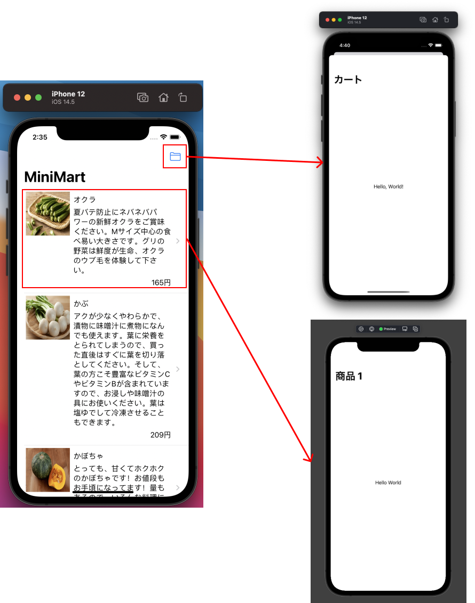
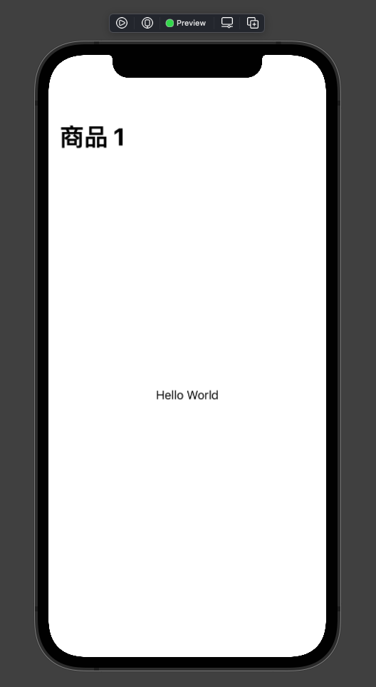
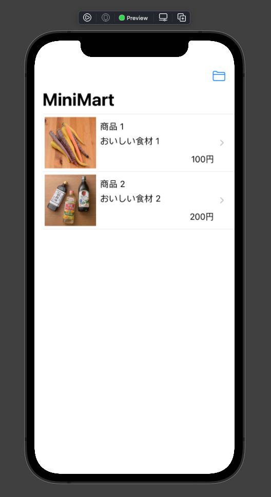
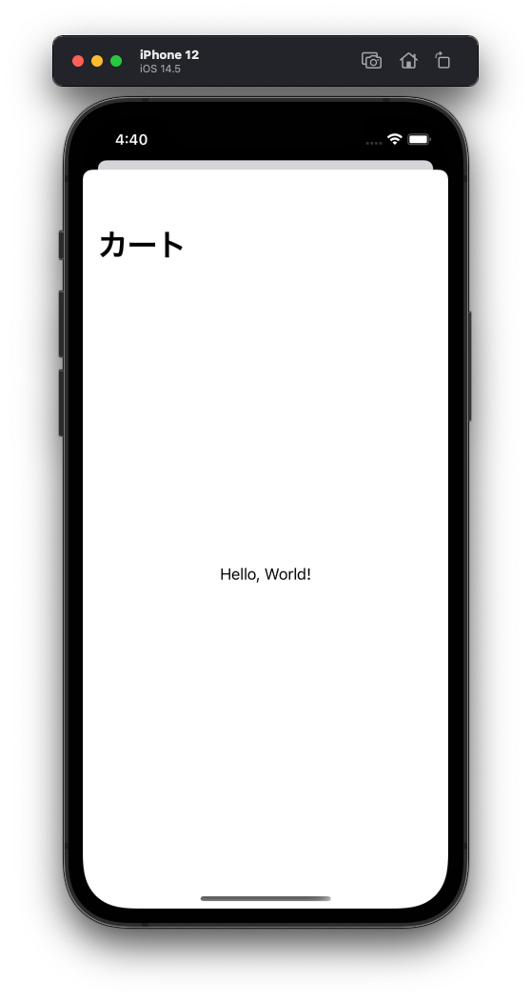

# 画面遷移

商品一覧画面ができたところで、カート画面と商品の詳細画面を作ります。
商品詳細画面、カート画面のそれぞれを空っぽの状態で作り、そこに遷移できるようにします。



この章では、商品詳細画面とカート画面へ遷移させる作業を通して

- NavigationViewによる画面遷移
- `.sheet`を使ったモーダル画面表示

を学びます。

## ProductDetailPageViewの追加

今までと同じように`ProductDetailPageView.swift`を`Application/Views`グループ下に作成します。

作成ができたらタイトルの設定をします。
どの商品を表示しているのかを示しておきたいので、商品の情報である、`FetchProductsQuery.Data.Product`を引数で受け取り、`navigationTitle`に設定するようにしましょう。

Previewでタイトルの表示を確認したいため、`NavigationView`で括りダミーのデータを渡すようにしておきます。

```swift

import SwiftUI

struct ProductDetailPageView: View {
    var product: FetchProductsQuery.Data.Product
    var body: some View {
        Text("Hello World")
            .navigationTitle(product.name)
    }
}

struct ProductDetailPageView_Previews: PreviewProvider {
    static var previews: some View {
        NavigationView {
            ProductDetailPageView(
                product: FetchProductsQuery.Data.Product(
                    id: UUID().uuidString,
                    name: "商品 \(1)",
                    price: 100,
                    summary: "おいしい食材 \(1)",
                    imageUrl: "https://image.mini-mart.com/dummy/1"
                )
            )
        }
    }
}
```

ここで`Resume`を押してXcode Previewを確認する。以下の表示になっていればOKです。



## ProductListPageViewからProductDetailPageViewを表示する

商品一覧画面の商品をタップしたら、商品詳細画面を表示するようにします。
画面遷移の方法は様々あるが、今回のようにリストの中から１つを選択し深い階層に潜る画面遷移には、`NavigationLink`を使った画面線が適しているので、これを実装していきます。

`ProductListPageView.swift`を開き、リストの1要素を表す`HStack`を`NavigationLink`で括ります。
`destination`は遷移先の商品詳細画面のインスタンスを渡します。


```diff

struct ProductListPageView: View {
    var body: some View {
        List(products, id: \.id) { product in
+           NavigationLink(destination: ProductDetailPageView(product: product)) {
                HStack(alignment: .top) {
                    RemoteImage(urlString: product.imageUrl)
                        .frame(width: 100, height: 100)
                    // 中略
                }
+           }

```


デバッグ実行をして確認をしてみましょう。
一覧画面で商品をタップして詳細画面が表示されればOKです。


## CartPageViewの追加と画面遷移

`CartPageView.swift`を`Application/Views`グループ下に作成してください。

`.navigationTitle`は「カート」にしておきましょう。


```swift
import SwiftUI

struct CartPageView: View {
    var body: some View {
        Text("Hello, World!")
            .navigationTitle("カート")
    }
}

struct CartPageView_Previews: PreviewProvider {
    static var previews: some View {
        NavigationView {
            CartPageView()
        }
    }
}


```

画面遷移の実装を行います。

以下の仕様のもと実装を進めます。

- ナビゲーションバーに配置したカートボタンが入り口
- 「モーダル表示」で画面を表示する

### ナビゲーションバーにボタンを置く

商品一覧画面のナビゲーションバーにカートボタンを置きます。

ナビゲーションバーにボタンを置くのには[`.toolbar`](https://developer.apple.com/documentation/swiftui/view/toolbar(content:)-5w0tj)モディファイアを使います。

これは使い方を覚えるのが早いので、ソースを変更し、その内容を見てみましょう。
`ProductListPageView.swift`の`body`を以下のように変更してください。

```diff
        List {
            // 中略
        }
+       .listStyle(PlainListStyle())
        .onAppear {
            // 中略
        }
        .navigationTitle("MiniMart")
+       .toolbar {
+           ToolbarItemGroup(placement: .navigationBarTrailing) {
+               Button(action: {}) {
+                   Image(systemName: "folder")
+               }
+           }
+       }

```

`Xcode Preview`で表示し、以下の状態になっていればOKです。　



コードの説明をします。

- `.listStyle(PlainListStyle())` Listのデザインを指定するModifierです。toolbarを表示すると何故かスタイルが変わってしまうので、PlainListStyleを指定しています。
- `.toolbar`はナビゲーションバー、またはツールバーを表示するためのモディファイア。クロージャの中には`ToolbarContent`に準拠している`View`を置く必要があります。
  - https://developer.apple.com/documentation/swiftui/view/toolbar(content:)-5w0tj
- `ToolbarItemGroup`は`ToolbarContent`に準拠した`View`。第一引数の`placement`で、コンテンツを置く位置を指定する。今回はナビゲーションバー（ヘッダー）の右側に置きたいので、`.navigationBarTrailing`を指定する
- `ToolbarItemGroup`のクロージャの中はバーに表示する`View`を置く。今回はボタンを１つ置きたいので、単に`Button`を配置している。
- Buttonのactionはボタンタップ時にコールバックされるクロージャ。今は何もしないので空っぽ
- Buttonの末尾のクロージャの中はボタンとして表示するView。[SF Symbols](https://developer.apple.com/sf-symbols/)のフォルダの画像を表示したいので、`Image(systemName: "folder")` を配置している


### カート画面をモーダル表示する

次にカートボタンのタップ時にカート画面をモーダル表示します。

モーダル表示とは今いる画面とは別の文脈の画面を一時的に表示するのに使われる表現です。iOSにおいては下からせり上がってくるアニメーションで画面を表示するのが標準の挙動です。

この実装はSwiftUIにおいては、`.sheet`モディファイアを使って行います。

これも使い方を覚えるのが早いので、ソースを変更し、その内容を見てみましょう。

[`sheet`のリファレンス](https://developer.apple.com/documentation/swiftui/view/sheet(ispresented:ondismiss:content:))

`ProductListPageView.swift`の`body`を以下のように変更してください。

```diff
struct ProductListPageView: View {
    @State var products: [FetchProductsQuery.Data.Product] = []
+   @State var isCartViewPresented: Bool = false

    var body: some View {
        List(products, id: \.id) { product in
            // 中略
        }
        .toolbar {
            ToolbarItemGroup(placement: .navigationBarTrailing) {
-               Button(action: {}) {
+               Button(action: {
+                   self.isCartViewPresented = true
+               }) {
                    Image(systemName: "folder")
                }
            }
        }
+       .sheet(isPresented: $isCartViewPresented) {
+           NavigationView {
+               CartPageView()
+           }
+       }
```

実行をし、ボタンのタップ時にカート画面が表示されればOK



コードの説明をする

- 宣言型UIでは別画面を表示していることも「状態」で表現をします。この例では「カート画面を表示しているかどうか」を`Bool`型の変数で持ち、trueなら表示、falseなら非表示というように表現しています。
- `@State var isCartViewPresented: Bool = false` は、モーダルの表示・非表示を制御する変数。後述する`.sheet`に渡す。初期はモーダルは非表示なので初期値を`false`にしている。
- `.sheet`がモーダル表示を行うモディファイア。いくつかのバリエーションがあるが、今回利用するのは`isPresented`の引数に`Bool`型の`@State`のプロパティを渡すもの。渡しているプロパティが`true`になると、`.sheet`に指定している`View`が表示されます。。`$`をつけているのは、モーダルが閉じられる際にSwiftUIのシステムが参照している変数を`false`に戻すため。
- ボタンが押されたらモーダル表示をしたいので、`Button`の`action`のコールバックに、`isCartViewPresented = true` とする処理を足している

これで必要な画面への遷移ができました

---

[Chapter6へ進む](chapter_06.md)
