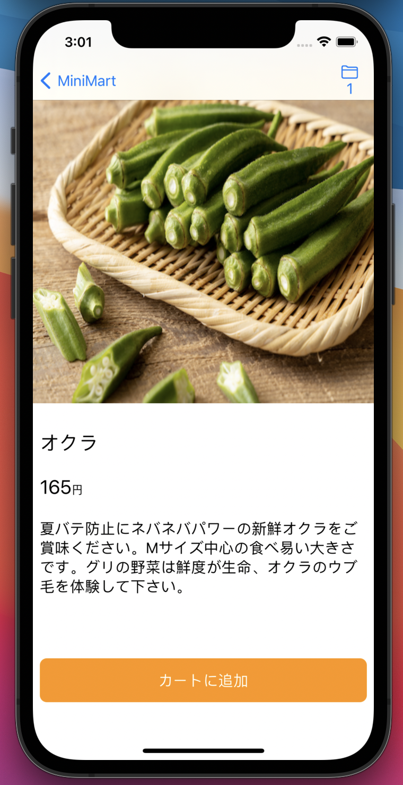

# 商品詳細画面を完成させる

chapter5が終わってない人は、いったん出来たところまでコミットしてください。

その後
```
git checkout ch7-initial
```
とすると、このchapterが開始できるところまでコードが進みます。

以下の仕様を満たす、商品詳細画面を完成させてください。
画面例を示しますが、そのとおりにする必要はありません。

- 商品の画像を画面幅いっぱいに広げて見せる
  - 画像の縦横比は崩さないようにする
  - クロップしても良いでしょう。画面例では高さが画面の幅と一致するようにしています。
- 商品名、商品説明、値段を見せる
- カートに商品を追加できる
- ナビゲーションバーにカートボタンを表示し、カート画面へ遷移ができる
- カートボタンにはカートに追加した商品の件数が表示される

## 画面例



## ヒント

- カートに追加した商品は様々な画面で共有されます。Stateではなく、ObservableObjectに準拠したクラスを作りEnvironmentObjectを使ってアプリ全体で共有するのが良いでしょう。
  - EnvironmentObjectはchapter_5で紹介しています。
  - これは少しややこしいのでコード例を後述します
- 角丸ボタンはTextに背景色をつけて、境界を丸くすることで実現できます
  - 背景色は`.background` modifierで変えることができます
  - 文字色は`.foregroundColor` modifierで変えることができます
  - Viewの角は`.cornerRadius` modifierで丸くすることができます
- 要素が画面内に収まらない場合、[ScrollView](https://developer.apple.com/documentation/swiftui/scrollview)を使うと良いでしょう
- 画面例ではナビゲーションバーが小さくなっています。ナビゲーションバーはタイトルを大きく表示するのか小さく表示するのかの２モードがあり、`.navigationBarTitleDisplayMode`でスタイルを調整できます。

## カートの状態をアプリ全体で共有する

今回はカートはインメモリで管理し、注文時にまとめてサーバにその内容を送るのが仕様です。

また、商品をカートに追加するのは商品詳細画面で行いますが、その内容はナビゲーションバーに配置したカートボタンや、カート画面から参照されます。

つまり状態が画面をまたいでいます。
これはどうすれば良いでしょうか。
SwiftUIにおいて画面をまたいで状態を共有する方法はいくつかありますが、chapter 5で説明した`ObservableObject`を利用して今回は実装を進めていきます。

### 状態を保持するクラスを作る

`ObservableObject`に準拠させた、`CartState`クラスを定義します。
`CartState.swift`を`Models`グループ以下に作成し、次のようにコードを記述します。

```swift
import Foundation
import Combine

final class CartState: ObservableObject {
    @Published var products: [FetchProductsQuery.Data.Product] = []
}

```

クラスにはカートに入っている商品を表す`products`という`Product`型の配列をもたせています。
この変数が変更された際にViewに通知をしたいので、`@Published`でラップしています。
(※ 説明をシンプルにするため、`FetchProductsQuery.Data.Product`の配列にしていますが、倣う必要はありません)

### 各画面から参照できるようにする

`MiniMartApp.swift`を以下のように書き換えてください

```diff
@main
struct MiniMartApp: App {
+   @StateObject var cartState = CartState()
    var body: some Scene {
        WindowGroup {
            NavigationView {
                ProductListPageView()
            }
+           .environmentObject(cartState)
        }
    }
}

```

これで各Viewが`@EnvironmentObject`をつけて`CartState`型の変数を宣言することで、`environmentObject`で渡したインスタンスを参照できるようになります。

```swift

struct ProductDetailPageView: View {
    @EnvironmentObject var cartState: CartState
}

```


---

[Chapter8へ進む](chapter_08.md)
