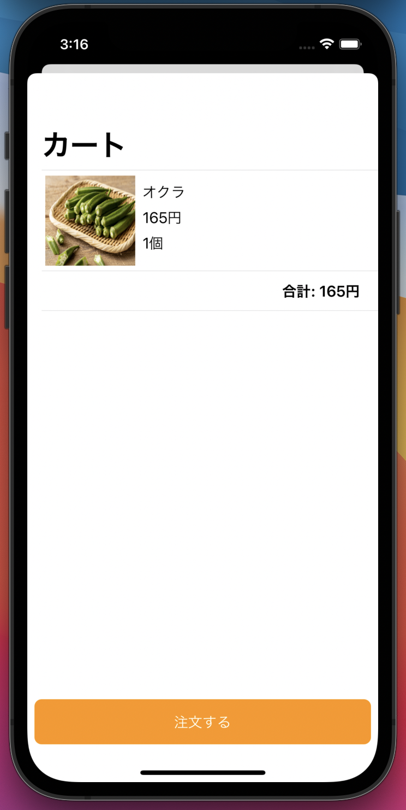

# カート画面を完成させる

以下の仕様を満たすカート画面を実装してください。

- カートに追加した商品が一覧で見られる
  - 同じ商品はまとめられ個数が表示される
- カート内の商品の合計金額が表示される
- 「注文」ボタンがあり、タップすると注文処理を行う
  - ※ 基本課題ではAPIは叩かなくて良いです
- 注文を行うと「注文しました」というアラートを表示する。アラートのOKボタンを押すと、カートを空にしてカート画面を閉じる。

## 画面例

## ヒント

- 繰り返し要素と固定要素が同居しています。どういう構造で作れるでしょうか
  - VStackでListとその他の要素を組み合わせるとどうなるでしょうか？試してみましょう
  - Listは配列を渡す以外の書き方もできます。公式サイトで確認してみましょう
    - [List](https://developer.apple.com/documentation/swiftui/list)
  - Listでなく、Chapter7で紹介した方法を使っても良いでしょう
- アラートの表示は`.alert`modifierを使います。リファレンスを参照し使ってみましょう
  - [alert](https://developer.apple.com/documentation/swiftui/view/alert(ispresented:content:))
  - deprecatedマークが付いていますが、気にせず利用してください。↑ページの`Use ...`で提示されている方法はiOS15以降でないと使えません。
- どうやってカート画面をユーザーの操作なしに閉じれば良いでしょうか
  - モーダルは第一引数に渡した`isPresented`が`true`なら表示され、`false`なら閉じられます
  - [`@Binding`](https://developer.apple.com/documentation/swiftui/binding)を使うと`@State`属性のついた変数を受け取り書き換えることができます
  - 呼び出し元の画面からClosureを渡し、完了をコールバックさせても良いでしょう

## 終わった人

ここまでできたら基本課題は完了です。お疲れさまでした。GitHub に push したら Slack で終了した旨を講師に伝えて、発展課題に進んでください。

---

[Chapter9へ進む](chapter_09.md)
