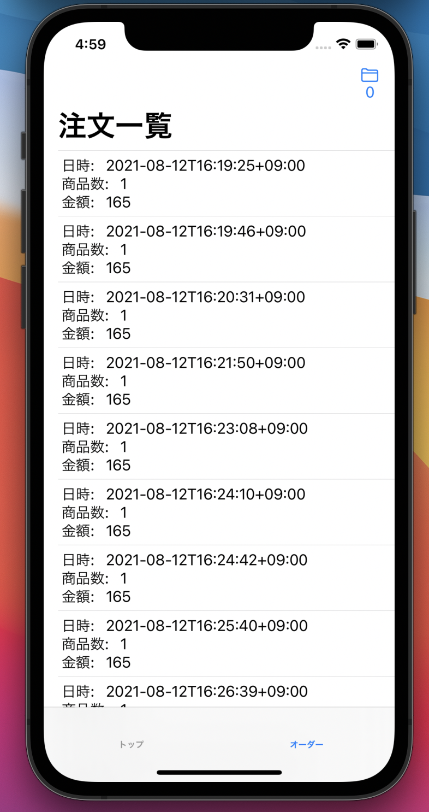
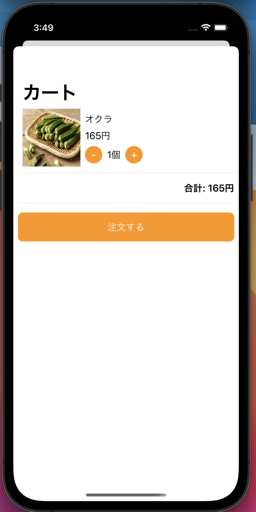
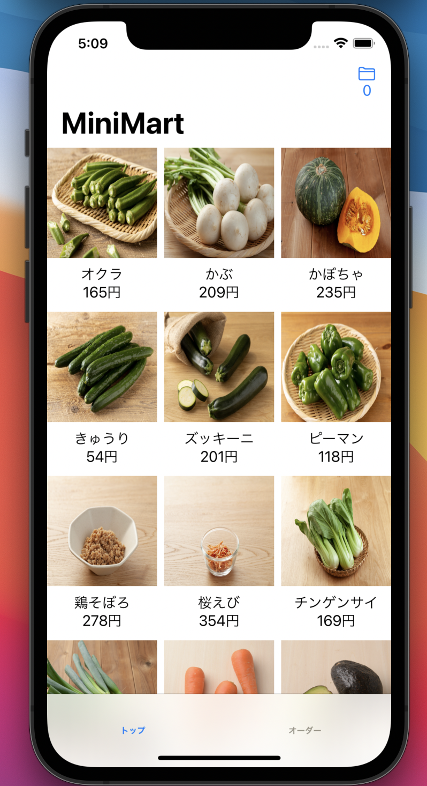

# 発展課題

※ Webと同じ課題が含まれてます。同じ課題に取り組んでもかまいません。

APIのドキュメントは、GraphQLのplaygroundを参照してください。

## 1. 注文時に注文APIを叩く

基本課題では注文時はダイアログを表示するだけでしたが、注文 API を呼び出して注文情報をサーバーに送るようにしてください。
正常系だけでなく失敗時にアラートを表示してあげる等、失敗したことをユーザーに見せる考慮をした実装を行ってください。

APIは以下です。

```

type Query {
  # ID で注文を引く
  order(id: ID!): Order
}

type Mutation {
  # 注文を確定する
  createOrder(input: CreateOrderInput!): CreateOrderPayload
}

```

## 2. 注文一覧画面を作る

導線をどこかに作り、注文の一覧画面を作ってください。
UIや画面構成はユーザーが何を見たいかを考えながら作ってみてください。
導線について、画面例では[TabView](https://developer.apple.com/documentation/swiftui/tabview)を使って画面下部にタブを作り、注文の一覧画面を表示しています。




APIは以下です。

```graphql

type Query {
  orders: [Order!]!
}

```

## 3. カート画面で商品を増減

基本課題では商品詳細ページからカートに追加できるだけでしたが、カート画面で商品の個数を変更できるようにしてください。



## 4. 一覧画面をグリッド表示にする

基本課題では商品一覧画面はリスト表示でしたが、Webと同様にグリッド表示を行えるようにしてください。
各要素は「サムネイル、名前、値段」の３つを表示するようにしてください。
グリッド表示には[LazyVGrid](https://developer.apple.com/documentation/swiftui/lazyvgrid)を使います。
使い方を調べながら実装に挑戦してみてください。

※ 画面例にはタブがついていますが無視してください



## 5. 注文をキャンセルできるようにする

行った注文は注文確定日時から３分以内であればキャンセルすることができます。注文の詳細画面を表示し、APIで注文のキャンセルを行えるようにしてください。
この課題に着手するためには応用課題1をクリアしている必要があります。

APIは以下です。

```graphql

type Mutation {
    cancelOrder(
    input: CancelOrderInput!
  ): CancelOrderPayload
}

```


## 6. 受け取り場所を変更する機能を作る

商品を注文するとき、商品を受け取る場所を指定できます。受け取り場所はユーザーに紐付いており、API でデフォルトの受け取り場所を変更することができます。ユーザー画面を作り ログイン中のユーザーの受け取り場所を表示・変更ができるようにしてください。

APIは以下です。

```graphql
type Query {
  # リクエストしたユーザー自身を返す
  viewer: User

  # すべての受け取り場所を返す
  pickupLocations: [PickupLocation!]!
}

type Mutation {
  # 自身のデフォルトの受け取り場所を変更する
  updatePickupLocation(input: UpdatePickupLocationInput!): UpdatePickupLocationPayload
}
```

## 7. 一覧画面から商品を追加する

基本課題では商品の追加は詳細画面からしかできませんでしたが、商品一覧画面からでも商品を追加できるようにしてください。

## 8. 商品を探しやすくする

テキスト検索やカテゴリごとに商品を表示するなどして、ユーザーが商品を探しやすくなる機能を実装してください。以下のような API が利用できます。

```graphql
type Query {
  # ある文字列を商品名または説明に含む商品を検索する
  searchProducts(query: String!): [Product!]!

  # すべての商品カテゴリを返す
  categories: [Category!]!

  # ID で商品カテゴリを引く
  category(id: ID!): Category
}

```

UIや画面構成はユーザーが探しやすくなるように考えて作ってみてください。
