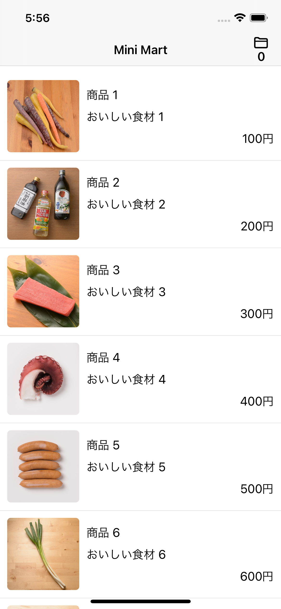
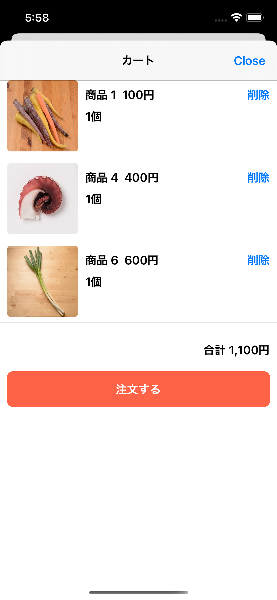

# MiniMart

## 内容

商品のリストが見れて注文ができるECサービス「MiniMart」のiOSアプリ

商品一覧 | 商品詳細 | カート
--- | --- | ---
 |  | 

## 機能

- 画面遷移
  - 商品一覧の商品をタップすると商品詳細へ遷移
  - ヘッダーのカートボタンをタップするとカートへ遷移
- 機能
  - 商品一覧はサーバから引いてくる
  - 商品詳細画面で商品をカートに追加できる
  - カート画面でカートに追加した商品を注文できる
    - 注文をするとカートの内容をクリアする
    - 基本課題ではカートを空にするだけでAPIは叩かない

## 技術仕様

- UIはSwiftUIで構築し、必要がなければUIKitは用いない
- APIサーバは `https://minimart-api.cookpadapp.com/`
  - graphqlのクライアントとして、[apollo-ios](https://github.com/apollographql/apollo-ios)を用いる